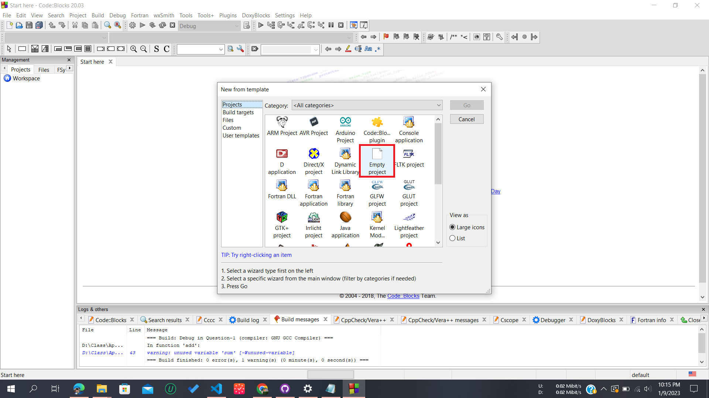
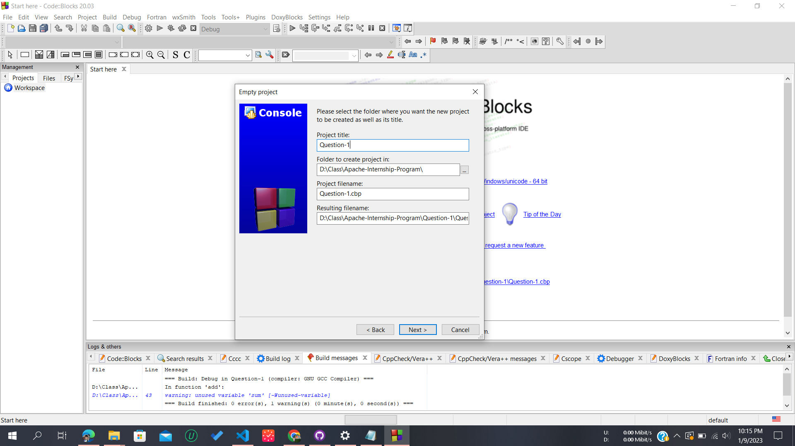
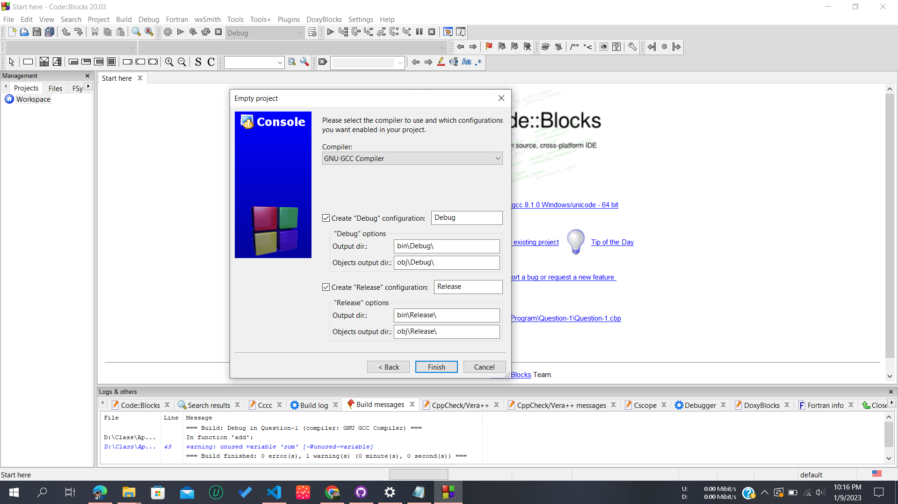
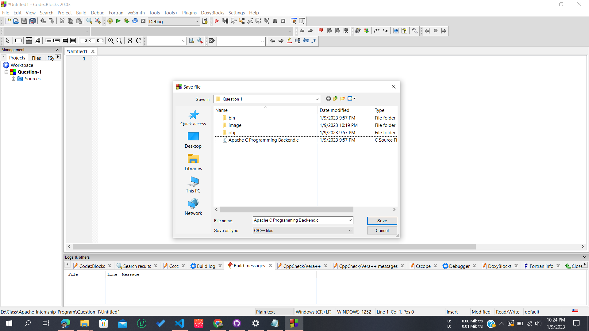
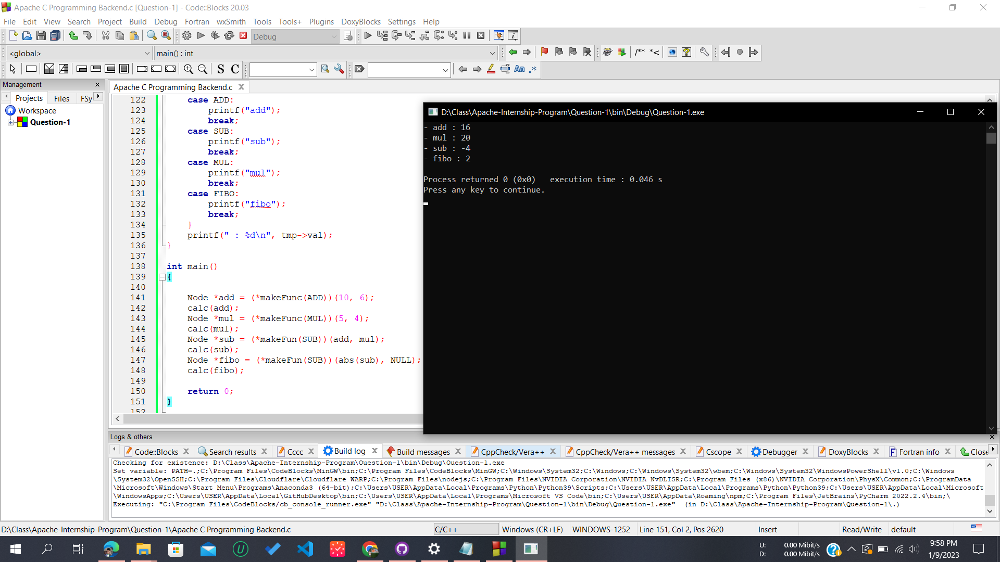

# [Question No. 1] Coding Test – Backend

## Installation

- Download and install MinGw
- Create a new Project
- Select Empty Project
  

- Write project title
  

- Click on Finish Button
  

- Create a new File
- Save the File
  
- Now compile and run `./Apache%20C%20Programming%20Backend.c` file

## Additional Information

- As c compailer doesn't support operator overloading changed function name `makeFunc` to `makeFun` for multiple use by using different parameter

## Final Result

