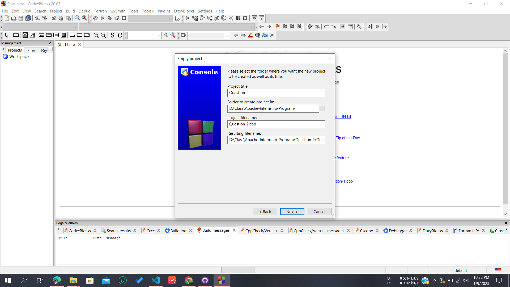

# [Question No. 2] Coding Test – Backend

## Installation

- Download and install MinGw
- Create a new Project
- Select Empty Project
  

- Write project title
  

- Click on Finish Button
  

- Create a new File
  
- Save the File
  
- Now compile and run `Matrix_Exponentiation_Approach.c` file
- For Matrix Exponentiation Approach use `Matrix_Exponentiation_Approach(n)`
- For Dynamic Programming Approach use `Dynamic_Programming_Approach(n)`
- For Brute Force Approach use `Brute_Force_Approach(n)`

## Solving Approach

```
F(n) = F(n-3) + F(n -2)
F(0) = 0
F(1) = 1
F(2) = 2
```

1. Matrix Exponentiation Approach

   - Time Complexity : logN
   - Space Complexity : (3)^2 \* log(N)
   - Advantages :
     - Less Time required for getting single value
   - Disadvantages :
     - Hard to implement
     - Hard to Understand Code
     - More time required for multiple use as it do not store any value

2. Dynamic Programming Approach

   - Time Complexity : N
   - Space Complexity : N
   - Advantages :
     - Easy to Implement
     - Less time required for multiple use as it store previous computaiton
   - Disadvantages :
     - A lot of memory wasted for single iteration

3. Brute Force Approach

   - Time Complexity : 3^N
   - Space Complexity : 3^N
   - Advantages :
     - Easy to Implement
     - Easy to Understand
   - Disadvantages :
     - Too much memory wasted required
     - Too much time wasted required

## Final Result


